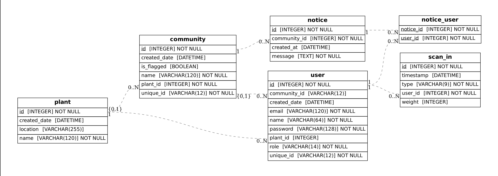

# Rollie Rollie (Rollie NoWaste)
Rollie NoWaste is an elaborate waste management system that uses two main concepts to solve the problem of segregating waste:

## 1. AI-based garbage classifier 
Concept: We use AI image recognition software to categorically segregate the waste. This technology will be added to the bins.  

PoC: The waste classification model is built using MobileNetV2 with pre-trained ImageNet weights. Data augmentation is applied to enhance the training set, and the model is trained on labeled images from the dataset using categorical cross-entropy loss. The base model is frozen to retain learned features, and a custom classifier is added on top.  

 

## 2. Community-Plant Management Software 
Concept: Each household uses a QR-coded keycard to access shared community bins. Every disposal is tracked, linking waste types and quantities to specific users. Waste is then transported to recycling centers where improper segregation is flagged. If consistent and repeated violations are detected, the entire community is fined.

- Accountability: Tracks waste by user and community.
- Automated Enforcement: Segregation is monitored through data, not manual checks.
- Behavioral Change: Fines and reports educate and incentivize proper recycling.
- Scalable & Transparent: Provides actionable data for governance and residents.

This system enforces responsible waste disposal through technology, transforming recycling into a monitored, data-driven process.

Implementation: This system was integrated into a web application. Each plant can track the amount of waste from each community it oversees and the people of the communities can track their bin usage. This data can be used to provide incentives or fines when actually deployed.  

### ERD Diagram for the database models

*note: the Plant class has a one-to-many relatonship with Community and User (directly) as well because the User object has roles defined by an enum. If a User object is given the `UserRole.PLANT_OPERATOR` role then this object is directly associated with the plant, otherwise a non-operator user is associated to its community.*